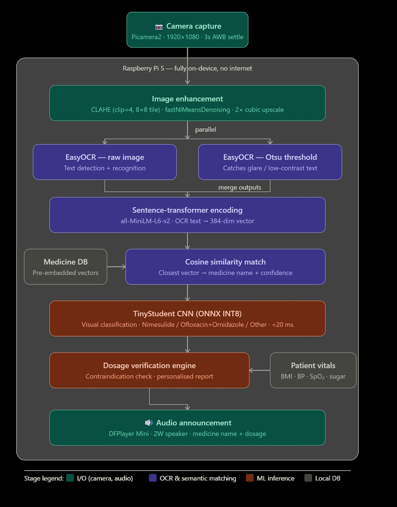
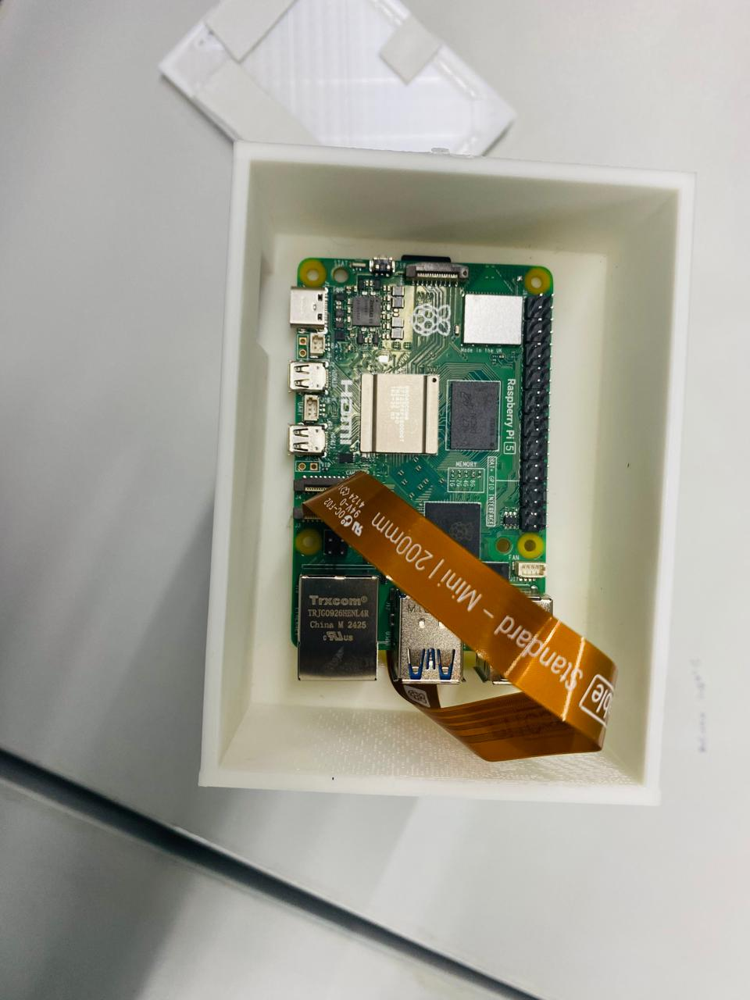
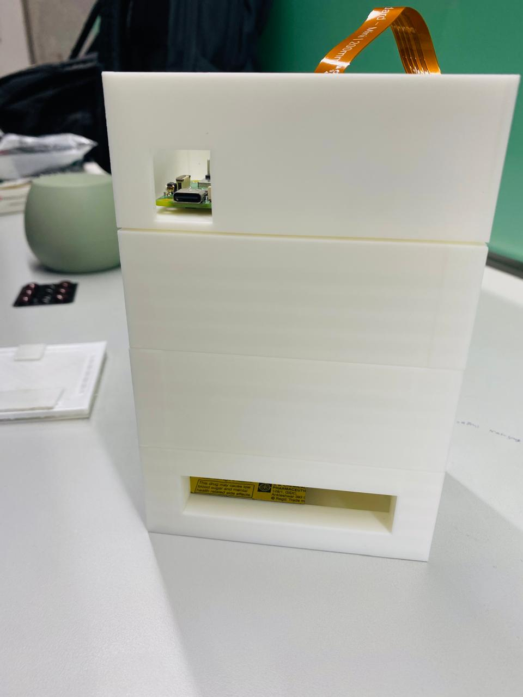
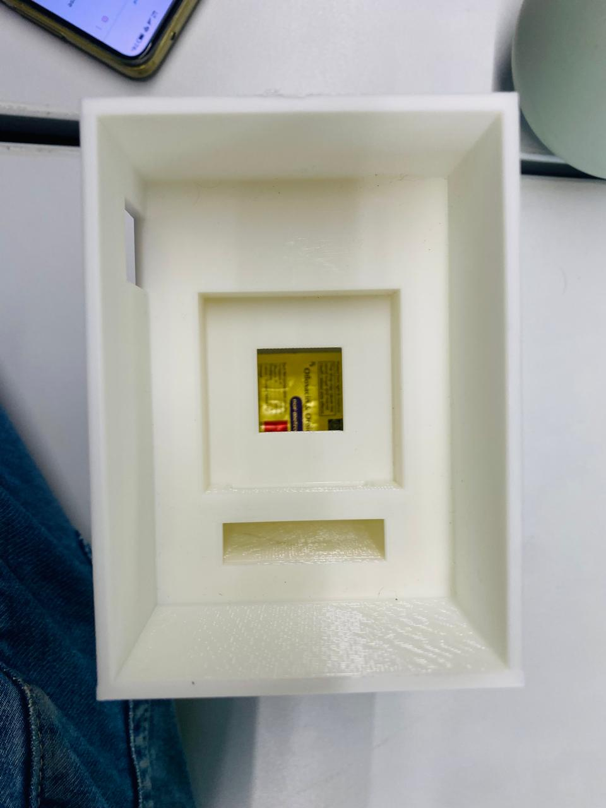
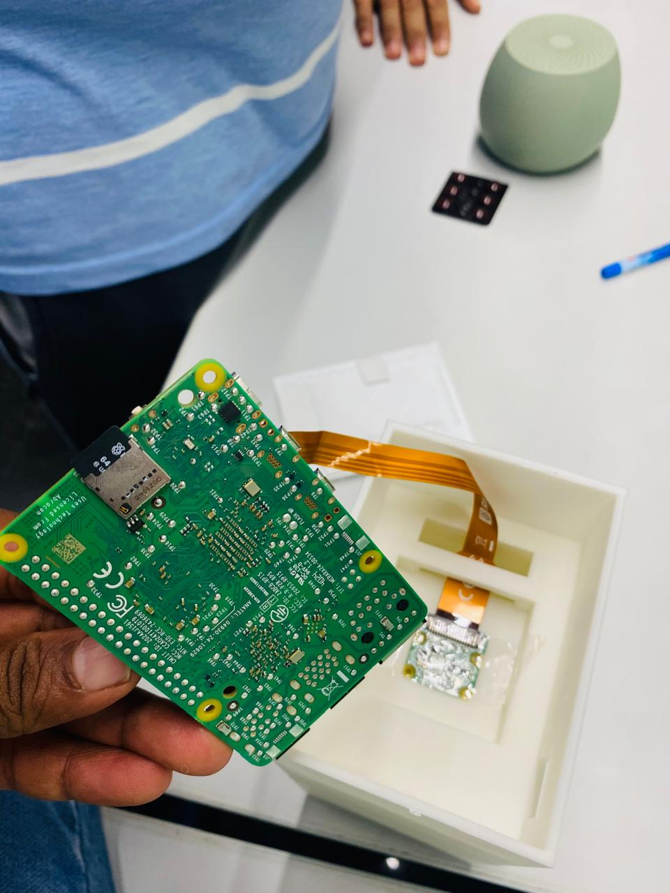
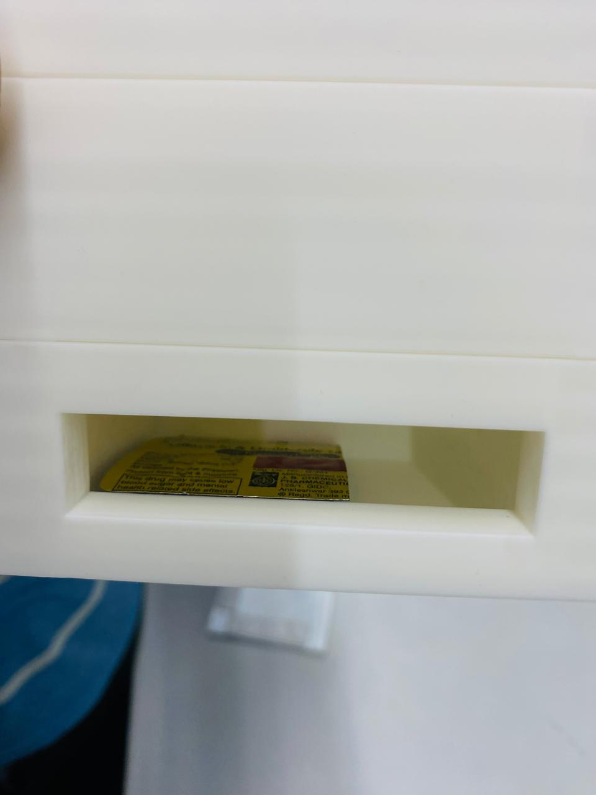
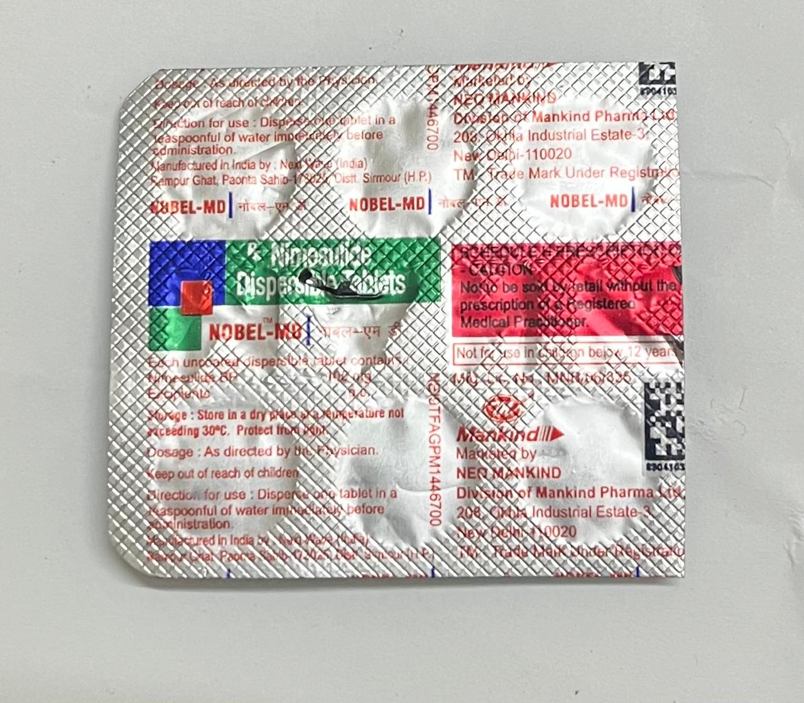

# 🏥 Medi-Dock — Intelligent Medication Identification Station
### CP 330: Edge AI | Indian Institute of Science, Bengaluru | 2025–2026

> **An offline, Raspberry Pi 5 powered assistive device that identifies medication labels and verifies dosages for visually impaired users — no internet required.**

[](LICENSE)
[](https://www.raspberrypi.com/)
[](https://pytorch.org/)

**Team:** Athikesavan V · Madina Gowtham Kumar · Pranav Kumar Rowlo · Vedang Mangrulkar

---

## 🔗 Course

This project was submitted as part of **CP 330: Edge AI** at the Indian Institute of Science, Bengaluru.

📖 Course website: [https://www.samy101.com/edge-ai-26/](https://www.samy101.com/edge-ai-26/)

---

## 📋 Project Report

The full project report is available in [`report.md`](report.md).

---

## 🗂️ Repository Structure

```
medi-dock/
├── README.md                          ← This file
├── report.md                          ← Full project report
│
├── notebooks/
│   ├── Edge_AI_Notebook_1.ipynb       ← Training pipeline (Kaggle)
│   └── Edge_AI_Notebook_2.ipynb       ← On-device inference (Raspberry Pi)
│
└── assets/
    ├── Hardware_Setup.jpeg            ← Raspberry Pi hardware setup photo
    ├── Enclosure.jpeg                 ← 3D-printed enclosure photo
    ├── Inside_View_Enclosure.jpeg     ← Inside view of enclosure
    ├── Placement_of_Camera.jpeg       ← Camera placement inside enclosure
    ├── Slot_to_insert_strip.jpeg      ← Strip insertion slot photo
    ├── Sample_Strip.jpeg              ← Sample medicine strip photo
    └── Class_Distribution_Graph.jpeg  ← Dataset class distribution bar chart
```

---

## 🧠 System Overview

Medi-Dock is a two-stage pipeline:

| Stage | What happens |
|---|---|
| **Stage 1 — Visual Classification** | TinyStudent CNN (Knowledge Distillation from ResNet-18) classifies blister pack images → *Nimesulide / Ofloxacin+Ornidazole / Unknown* |
| **Stage 2 — OCR + Semantic Matching** | EasyOCR extracts label text → sentence-transformer embeds it → cosine similarity matches to medicine database → dosage rules engine cross-checks patient vitals |

<p align="center">
  
</p>
<p align="center">
  <em>Figure: System pipeline diagram.</em>
</p>

<p align="center">
  
</p>
<p align="center">
  <em>Figure 1: Medi-Dock hardware setup — Raspberry Pi 5, Camera Module 3, and DFPlayer Mini.</em>
</p>

<p align="center">
  
</p>
<p align="center">
  <em>Figure 2: Custom 3D-printed dock enclosure.</em>
</p>

<p align="center">
  
</p>
<p align="center">
  <em>Figure 3: Inside view of the enclosure showing component layout.</em>
</p>

<p align="center">
  
</p>
<p align="center">
  <em>Figure 4: Camera module mounted inside the dock.</em>
</p>

<p align="center">
  
</p>
<p align="center">
  <em>Figure 5: Strip insertion slot on the Medi-Dock.</em>
</p>

<p align="center">
  
</p>
<p align="center">
  <em>Figure 6: Sample medicine blister strip used for testing.</em>
</p>

---

## 🛠️ Hardware Bill of Materials

| Component | Details | Link |
|---|---|---|
| Raspberry Pi 5 | 4GB RAM, ARM Cortex-A76 | [Link](https://www.raspberrypi.com/products/raspberry-pi-5/) |
| Camera Module 3 | 12MP, autofocus | Raspberry Pi official |
| DFPlayer Mini | MP3 audio module | [Link](https://www.dfrobot.com/product-1121.html) |
| 2W Speaker ×2 | 8Ω | Standard |
| Power Supply | 5V/3A USB-C | Standard |
| 3D-printed enclosure | Custom design | See `/assets/` |

---

## ⚙️ Setup & Reproduction

### 1. Training (Run on Kaggle with GPU)

1. Upload `notebooks/Medi_Dock_Edge_AI_Notebbok_1.ipynb` to Kaggle.
2. Add the three datasets listed in the notebook (links in Cell 2).
3. Run all cells sequentially. Training takes ~15–20 min on a Kaggle T4 GPU.

### 2. Raspberry Pi Setup

```bash
# On Raspberry Pi 5 (Raspberry Pi OS Bookworm)
sudo apt-get update && sudo apt-get install -y python3-pip libatlas-base-dev

pip3 install onnxruntime easyocr sentence-transformers opencv-python picamera2
```

### 3. Run the Pipeline

```bash
# On Raspberry Pi — opens camera, runs OCR + classification + dosage check
cd /home/pi/medi-dock
jupyter notebook notebooks/Medi_Dock_Edge_AI_Notebbok_2.ipynb
# Or run cells 1-5 sequentially for the full pipeline
```

Edit the patient vitals in the final cell of Notebook 2 (`suggest_dosage(...)`) before running.

---

## 📊 Results Summary

**Pruning:** 45.29% of weights removed (magnitude threshold = 0.025)

| Model | Parameters | FLOPs | Latency | Throughput |
|---|---|---|---|---|
| Teacher (ResNet-18) | 11,178,051 | 1.814 GFLOPs | 39.55 ms | 25.3 FPS |
| Student (Original) | 98,307 | 0.049 GFLOPs | 4.10 ms | 244.0 FPS |
| Student (After Pruning) | 98,307 | 0.049 GFLOPs | 4.89 ms | 204.5 FPS |

- **113× fewer parameters** than the teacher
- **37× fewer FLOPs** (1.814 GFLOPs → 0.049 GFLOPs)
- **~10× faster inference** — 244 FPS vs 25.3 FPS on CPU
- Post-pruning size reduced ~4× via INT8 quantisation (~0.19 MB final model)

> 📊 Class distribution:

<p align="center">
  
</p>
<p align="center">
  <em>Figure 7: Dataset class distribution across the three medication classes.</em>
</p>

---

## 🤖 AI Tool Attribution

Parts of this project utilised AI-assisted code generation (Claude by Anthropic) for scaffolding the synthetic data generator, Knowledge Distillation loop, sentence-transformer matcher, and dosage logic. All generated code was reviewed and integrated by the team members. Core architecture decisions, hardware design, and results are original work.

---

## 📚 Datasets

1. [Medicine Tablet Pack Image Dataset — Kaggle](https://www.kaggle.com/datasets/nitesh31mishra/medicine-tablet-pack-image-dataset)
2. [Mobile Captured Pharmaceutical Medication Packages — Kaggle](https://www.kaggle.com/datasets/aryashah2k/mobile-captured-pharmaceutical-medication-packages)
3. [Drug Name Detection Dataset — Kaggle](https://www.kaggle.com/datasets/pkdarabi/the-drug-name-detection-dataset)

---

## ⚠️ Disclaimer

The dosage recommendation module is for **educational and demonstration purposes only**. Always consult a licensed physician for actual medical dosage decisions.

---

## 📄 License

MIT License — see [LICENSE](LICENSE) for details.
